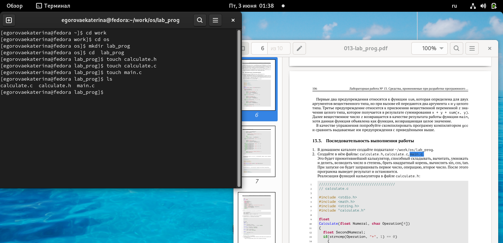
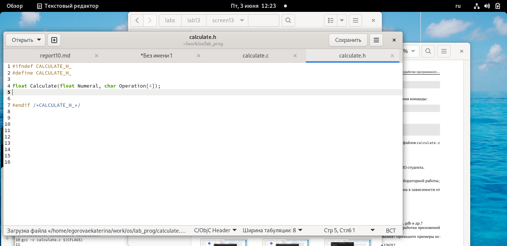
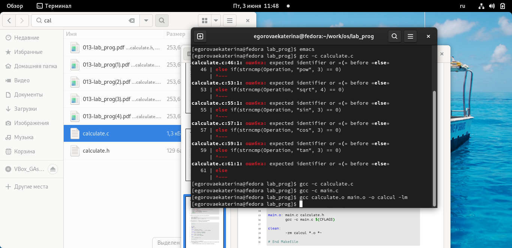
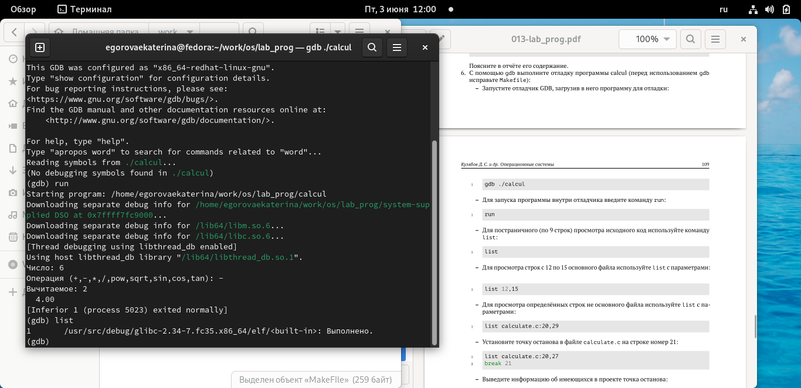
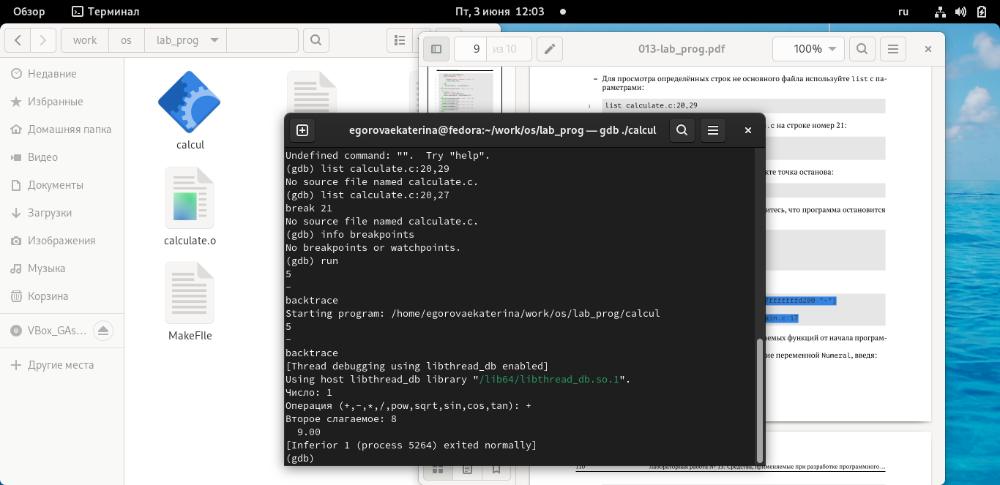
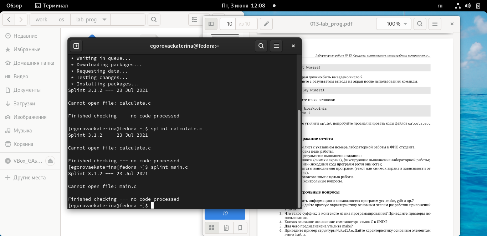

---
## Front matter
title: "Отчёта по лабораторной работе №6"
subtitle: "Дисциплина: операционные системы"
author: "Егорова Екатерина Олеговна "

## Generic otions
lang: ru-RU
toc-title: "Содержание"

## Bibliography
bibliography: bib/cite.bib
csl: pandoc/csl/gost-r-7-0-5-2008-numeric.csl

## Pdf output format
toc: true # Table of contents
toc-depth: 2
lof: true # List of figures
lot: true # List of tables
fontsize: 12pt
linestretch: 1.5
papersize: a4
documentclass: scrreprt
## I18n polyglossia
polyglossia-lang:
  name: russian
  options:
	- spelling=modern
	- babelshorthands=true
polyglossia-otherlangs:
  name: english
## I18n babel
babel-lang: russian
babel-otherlangs: english
## Fonts
mainfont: PT Serif
romanfont: PT Serif
sansfont: PT Sans
monofont: PT Mono
mainfontoptions: Ligatures=TeX
romanfontoptions: Ligatures=TeX
sansfontoptions: Ligatures=TeX,Scale=MatchLowercase
monofontoptions: Scale=MatchLowercase,Scale=0.9
## Biblatex
biblatex: true
biblio-style: "gost-numeric"
biblatexoptions:
  - parentracker=true
  - backend=biber
  - hyperref=auto
  - language=auto
  - autolang=other*
  - citestyle=gost-numeric
## Pandoc-crossref LaTeX customization
figureTitle: "Рис."
tableTitle: "Таблица"
listingTitle: "Листинг"
lofTitle: "Список иллюстраций"
lotTitle: "Список таблиц"
lolTitle: "Листинги"
## Misc options
indent: true
header-includes:
  - \usepackage{indentfirst}
  - \usepackage{float} # keep figures where there are in the text
  - \floatplacement{figure}{H} # keep figures where there are in the text
---

# Цель работы
Приобрести простейшие навыки разработки, анализа, тестирования и отладки при-
ложений в ОС типа UNIX/Linux на примере создания на языке программирования
С калькулятора с простейшими функциями.

# Задание

1. В домашнем каталоге создайте подкаталог ~/work/os/lab_prog.
2. Создайте в нём файлы: calculate.h, calculate.c, main.c.
Это будет примитивнейший калькулятор, способный складывать, вычитать, умножать
и делить, возводить число в степень, брать квадратный корень, вычислять sin, cos, tan.
При запуске он будет запрашивать первое число, операцию, второе число. После этого
программа выведет результат и остановится.

3. Выполните компиляцию программы посредством gcc:

4. При необходимости исправьте синтаксические ошибки.
5. Создайте Makefile со следующим содержанием:

6. С помощью gdb выполните отладку программы calcul (перед использованием gdb
исправьте Makefile):
– Запустите отладчик GDB, загрузив в него программу для отладки:

7. С помощью утилиты splint попробуйте проанализировать коды файлов calculate.c
и main.c

# Выполнение лабораторной работы

1. В домашнем каталоге создала подкаталог ~/work/os/lab_prog.Создала в нём файлы: calculate.h, calculate.c, main.c.
Это будет примитивнейший калькулятор, способный складывать, вычитать, умножать
и делить, возводить число в степень, брать квадратный корень, вычислять sin, cos, tan.
При запуске он будет запрашивать первое число, операцию, второе число. После этого
программа выведет результат и остановится.

рис.[-@fig:001] рис.[-@fig:002] рис.[-@fig:003]

{ #fig:001 width=70% }

{ #fig:002 width=70% }

{ #fig:003 width=70% }

2.  Выполнила компиляцию программы посредством gcc 

рис.[-@fig:004]

{ #fig:004 width=70% }

3. Создайла Makefile со следующим содержанием:

рис.[-@fig:005]

{ #fig:005 width=70% }

4. С помощью gdb выполнила отладку программы calcul (перед использованием gdb
исправьте Makefile):

рис.[-@fig:006] рис.[-@fig:007] рис.[-@fig:008] рис.[-@fig:009]

{ #fig:006 width=70% }

{ #fig:007 width=70% }

{ #fig:008 width=70% }

{ #fig:009 width=70%}

5. С помощью утилиты splint попробовала проанализировать коды файлов calculate.c
и main.c

рис.[-@fig:010]

{ #fig:010 width=70%}

# Вывод

Приобрела простейшие навыки разработки, анализа, тестирования и отладки при-
ложений в ОС типа UNIX/Linux на примере создания на языке программирования
С калькулятора с простейшими функциями.

# Контрольные вопросы
1. Как получить информацию о возможностях программ gcc, make, gdb и др.?
2. Назовите и дайте краткую характеристику основным этапам разработки приложений
в UNIX.
3. Что такое суффикс в контексте языка программирования? Приведите примеры ис-
пользования.
4. Каково основное назначение компилятора языка С в UNIX?
5. Для чего предназначена утилита make?
6. Приведите пример структуры Makefile. Дайте характеристику основным элементам
этого файла.
7. Назовите основное свойство, присущее всем программам отладки. Что необходимо
сделать, чтобы его можно было использовать?
8. Назовите и дайте основную характеристику основным командам отладчика gdb.
9. Опишите по шагам схему отладки программы, которую Вы использовали при выпол-
нении лабораторной работы.
10. Прокомментируйте реакцию компилятора на синтаксические ошибки в программе
при его первом запуске.
11. Назовите основные средства, повышающие понимание исходного кода программы.
12. Каковы основные задачи, решаемые программой splint?

# Оветы на контрольные вопросы

Информацию об этих программах можно получить с помощью функций info и man.
Unix поддерживает следующие основные этапы разработки приложений: -создание исходного кода программы; - представляется в виде файла -сохранение различных вариантов исходного текста; -анализ исходного текста; необходимо отслеживать изменения исходного кода, а также при работе более двух программистов над проектом программы нужно, чтобы они не делали изменений кода в одно время.-компиляция исходного текста и построение исполняемого модуля; -тестирование и отладка; - проверка кода на наличие ошибок -сохранение всех изменений, выполняемых при тестировании и отладке.
Использование суффикса “.с” для имени файла с программой на языке Си отражает удобное и полезное соглашение, принятое в ОС UNIX. Для любого имени входного файла суффикс определяет какая компиляция требуется. Суффиксы и префиксы указывают тип объекта. Одно из полезных свойств компилятора Си — его способность по суффиксам определять типы файлов. По суффиксу .c компилятор распознает, что файл abcd.c должен компилироваться, а по суффиксу .o, что файл abcd.о является объектным модулем и для получения исполняемой программы необходимо выполнить редактирование связей. Простейший пример командной строки для компиляции программы abcd.c и построения исполняемого модуля abcd имеет вид: gcc -o abcd abcd.c. Некоторые проекты предпочитают показывать префиксы в начале текста изменений для старых (old) и новых (new) файлов. Опция – prefix может быть использована для установки такого префикса. Плюс к этому команда bzr diff -p1 выводит префиксы в форме которая подходит для команды patch -p1.
Основное назначение компилятора с языка Си заключается в компиляции всей программы в целом и получении исполняемого модуля.
При разработке большой программы, состоящей из нескольких исходных файлов заголовков, приходится постоянно следить за файлами, которые требуют перекомпиляции после внесения изменений. Программа make освобождает пользователя от такой рутинной работы и служит для документирования взаимосвязей между файлами. Описание взаимосвязей и соответствующих действий хранится в так называемом make-файле, который по умолчанию имеет имя makefile или Makefile.
В общем случае make-файл содержит последовательность записей (строк), определяющих зависимости между файлами. Первая строка записи представляет собой список целевых (зависимых) файлов, разделенных пробелами, за которыми следует двоеточие и список файлов, от которых зависят целевые. Текст, следующий за точкой с запятой, и все последующие строки, начинающиеся с литеры табуляции, являются командами OC UNIX, которые необходимо выполнить для обновления целевого файла. Таким образом, спецификация взаимосвязей имеет формат: target1 [ target2…]: [:] [dependment1…] [(tab)commands] [#commentary] [(tab)commands] [#commentary], где # — специфицирует начало комментария, так как содержимое строки, начиная с # и до конца строки, не будет обрабатываться командой make; : — последовательность команд ОС UNIX должна содержаться в одной строке make-файла (файла описаний), есть возможность переноса команд (), но она считается как одна строка; :: — последовательность команд ОС UNIX может содержаться в нескольких последовательных строках файла описаний. Приведённый выше make-файл для программы abcd.c включает два способа компиляции и построения исполняемого модуля. Первый способ предусматривает обычную компиляцию с построением исполняемого модуля с именем abcd. Второй способ позволяет включать в исполняемый модуль testabcd возможность выполнить процесс отладки на уровне исходного текста. Пример можно найти в задании 5.
Пошаговая отладка программ заключается в том, что выполняется один оператор программы и, затем контролируются те переменные, на которые должен был воздействовать данный оператор. Если в программе имеются уже отлаженные подпрограммы, то подпрограмму можно рассматривать, как один оператор программы и воспользоваться вторым способом отладки программ. Если в программе существует достаточно большой участок программы, уже отлаженный ранее, то его можно выполнить, не контролируя переменные, на которые он воздействует. Использование точек останова позволяет пропускать уже отлаженную часть программы. Точка останова устанавливается в местах, где необходимо проверить содержимое переменных или просто проконтролировать, передаётся ли управление данному оператору. Практически во всех отладчиках поддерживается это свойство (а также выполнение программы до курсора и выход из подпрограммы). Затем отладка программы продолжается в пошаговом режиме с контролем локальных и глобальных переменных, а также внутренних регистров микроконтроллера и напряжений на выводах этой микросхемы.
backtrace - вывод на экран пути к текущей точке останова (по сути вывод названий всех функций) break - установить точку останова (в качестве параметра можетбыть указан номер строки или название функции) clear - удалить все точки останова в функции continue - продолжить выполнение программы delete - удалить точку останова display - добавить выражение в список выражений, значения которых отображаются при достижении точки останова программы finish - выполнить программу до момента выхода из функцииinfo breakpoints - вывести на экран список используемых точек останова info watchpoints - вывести на экран список используемых контрольных выражений list - вывести на экран исходный код (в качестве параметра может быть указано название файла и через двоеточие номера начальной и конечной строк) next - выполнить программу пошагово, но без выполнения вызываемых в программе функций print - вывести значение указываемого в качестве параметра выражения run - запуск программы на выполнение set - установить новое значение переменной step - пошаговое выполнение программы watch - установить контрольное выражение, при изменении значения которого программа будет остановлена
Выполнила компиляцию программы 2)Увидела ошибки в программе 3) Открыла редактор и исправила программу 4) Загрузила программу в отладчик gdb 5) run — отладчик выполнил программу, ввела требуемые значения. 6) Использовала другие команды отладчика и проверила работу программы
Отладчику не понравился формат %s для &Operation, т.к %s — символьный формат, а значит необходим только Operation.
Если вы работаете с исходным кодом, который не вами разрабатывался, то назначение различных конструкций может быть не совсем понятным. Система разработки приложений UNIX предоставляет различные средства, повышающие понимание исходного кода. К ним относятся: – cscope - исследование функций, содержащихся в программе; – splint — критическая проверка программ, написанных на языке Си.
Проверка корректности задания аргументов всех использованных в программе функций, а также типов возвращаемых ими значений; 2.Поиск фрагментов исходного текста, корректных с точки зрения синтаксиса языка Си, но малоэффективных с точки зрения их реализации или содержащих в себе семантические ошибки; 3.Общая оценка мобильности пользовательской программы.

