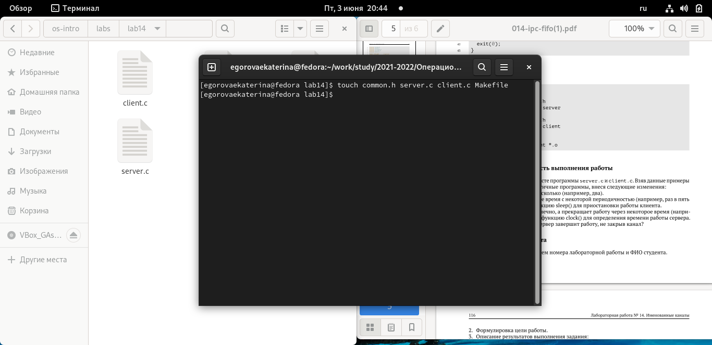
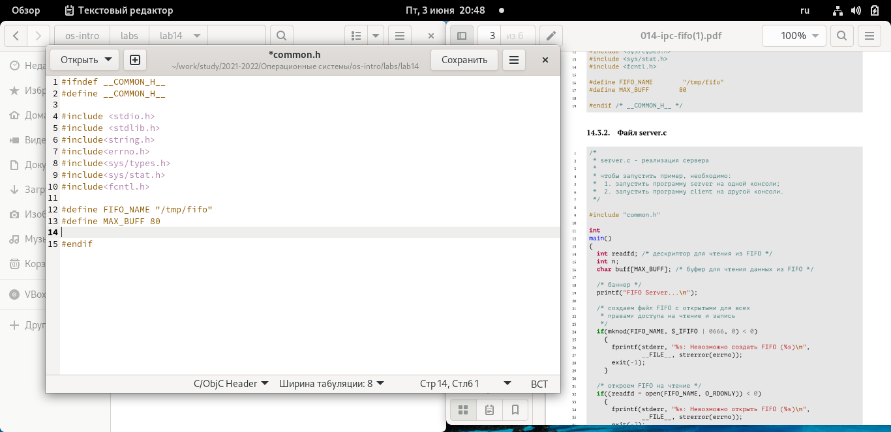
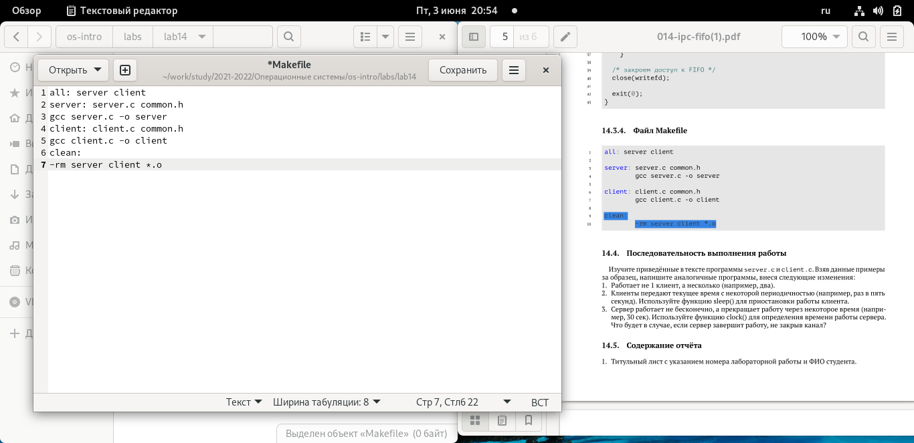
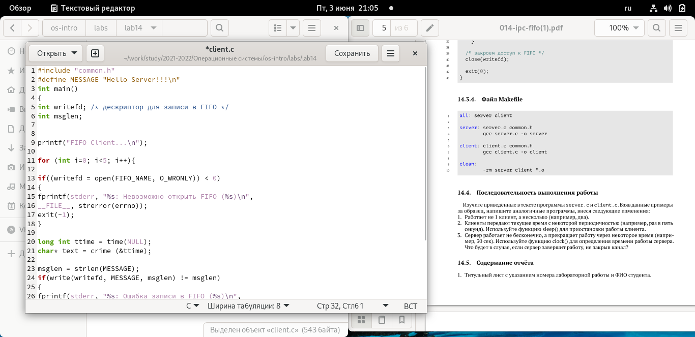
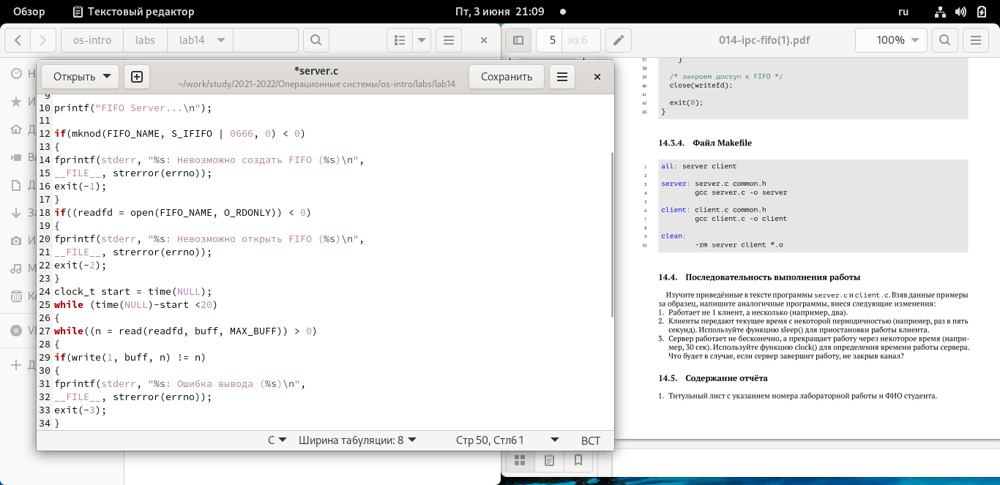
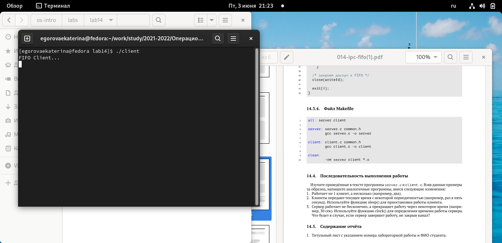

---
## Front matter
lang: ru-RU
title: Structural approach to the deep learning method
author: | Egorova Ekaterina Olegovna
	
institute: |
	\inst{1}RUDN University, Moscow, Russian Federation
	

## Formatting
toc: false
slide_level: 72
theme: metropolis
header-includes: 
 - \metroset{progressbar=frametitle,sectionpage=progressbar,numbering=fraction}
 - '\makeatletter'
 - '\beamer@ignorenonframefalse'
 - '\makeatother'
aspectratio: 43
section-titles: true
# Цель работы
Приобретение практических навыков работы с именованными каналами.
# Задание
Изучите приведённые в тексте программы server.c и client.c. Взяв данные примеры
за образец, напишите аналогичные программы, внеся следующие изменения:
1. Работает не 1 клиент, а несколько (например, два).
2. Клиенты передают текущее время с некоторой периодичностью (например, раз в пять
секунд). Используйте функцию sleep() для приостановки работы клиента.
3. Сервер работает не бесконечно, а прекращает работу через некоторое время (напри-
мер, 30 сек). Используйте функцию clock() для определения времени работы сервера.
Что будет в случае, если сервер завершит работу, не закрыв канал?
# Выполнение лабораторной работы

##Cоздала файлы с помощью команды и отредактировала их.

рис.[-@fig:001]

{ #fig:001 width=70%}

## Изменила код программы common.h 

рис.[-@fig:002]

{ #fig:002 width=70%}

## Оставила без изменений Makefile 

рис.[-@fig:003]

{ #fig:003 width=70%}

## Изменила файл client.c. Использовала функцию sleep() для приостановки работы клиента.

рис.[-@fig:004]

{ #fig:004 width=70%}

## Изменила файл server.c Использовала функцию clock() для определения времени работы сервера.

рис.[-@fig:005]

{ #fig:005 width=70%}

## Проверяю работу кода. 

рис.[-@fig:006]

{ #fig:006 width=70%}

# Вывод
Приобрела практические навыки работы с именованными каналами.

# Контрольные вопросы

В чем ключевое отличие именованных каналов от неименованных?
Возможно ли создание неименованного канала из командной строки?
Возможно ли создание именованного канала из командной строки?
Опишите функцию языка С, создающую неименованный канал.
Опишите функцию языка С, создающую именованный канал.
Что будет в случае прочтения из fifo меньшего числа байтов, чем находится в канале?
Большего числа байтов?
Аналогично, что будет в случае записи в fifo меньшего числа байтов, чем позволяет
буфер? Большего числа байтов?
Могут ли два и более процессов читать или записывать в канал?
Опишите функцию write (тип возвращаемого значения, аргументы и логику работы).
Что означает 1 (единица) в вызове этой функции в программе server.c (строка 42)?
Опишите функцию strerror.

# Оветы на контрольные вопросы
Именованные каналы отличаются от неименованных наличием идентификатора канала, который представлен как специальный файл (соответственно имя именованного канала − это имя файла). Поскольку файл находится на локальной файловой системе, данное IPC используется внутри одной системы.
Чтобы создать неименованный канал из командной строки нужно использовать символ |, служащий для объединения двух и более процессов: процесс_1 | процесс_2 | процесс_3…
Чтобы создать именованный канал из командной строки нужно использовать либо команду «mknod », либо команду «mkfifo ».
Неименованный канал является средством взаимодействия между связанными процессами − родительским и дочерним. Родительский процесс создает канал при помощи системного вызова: «int pipe(int fd[2]);». Массив из двух целых чисел является выходным параметром этого системного вызова. Если вызов выполнился нормально, то этот массив содержит два файловых дескриптора. fd[0] является дескриптором для чтения из канала, fd[1] − дескриптором для записи в канал. Когда процесс порождает другой процесс, дескрипторы родительского процесса наследуются дочерним процессом, и, таким образом, прокладывается трубопровод между двумя процессами. Естественно, что один из процессов использует канал только для чтения, а другой − только для записи. Поэтому, если, например, через канал должны передаваться данные из родительского процесса в дочерний, родительский процесс сразу после запуска дочернего процесса закрывает дескриптор канала для чтения, а дочерний процесс закрывает дескриптор для записи. Если нужен двунаправленный обмен данными между процессами, то родительский процесс создает два канала, один из которых используется для передачи данных в одну сторону, а другой − в другую.
Файлы именованных каналов создаются функцией mkfifo() или функцией mknod: • «int mkfifo(const charpathname, mode_t mode);», где первый параметр − путь, где будет располагаться FIFO (имя файла, идентифицирующего канал), второй параметр определяет режим работы с FIFO (маска прав доступа к файлу), • «mknod (namefile, IFIFO | 0666, 0)», где namefile − имя канала, 0666 − к каналу разрешен доступ на запись и на чтение любому запросившему процессу), • «int mknod(const char pathname, mode_t mode, dev_t dev);». Функция mkfifo() создает канал и файл соответствующего типа. Если указанный файл канала уже существует, mkfifo() возвращает -1. После создания файла канала процессы, участвующие в обмене данными, должны открыть этот файл либо для записи, любо для чтения.
При чтении меньшего числа байтов, чем находится в канале или FIFO, возвращается требуемое число байтов, остаток сохраняется для последующих чтений. При чтении большего числа байтов, чем находится в канале или FIFO, возвращается доступное число байтов. Процесс, читающий из канала, должен соответствующим образом обработать ситуацию, когда прочитано меньше, чем заказано.
Запись числа байтов, меньшего емкости канала или FIFO, гарантированно атомарно. Это означает, что в случае, когда несколько процессов одновременно записывают в канал, порции данных от этих процессов не перемешиваются. При записи большего числа байтов, чем это позволяет канал или FIFO, вызов write(2) блокируется до освобождения требуемого места. При этом атомарность операции не гарантируется. Если процесс пытается записать данные в канал, не открытый ни одним процессом на чтение, процессу генерируется сигнал SIGPIPE, а вызов write(2) возвращает 0 с установкой ошибки (errno=ERRPIPE) (если процесс не установил обработки сигнала SIGPIPE, производится обработка по умолчанию − процесс завершается).
Количество процессов, которые могут параллельно присоединяться к любому концу канала, не ограничено. Однако если два или более процесса записывают в канал данные одновременно, каждый процесс за один раз может записать максимум PIPE BUF байтов данных. Предположим, процесс (назовем его А) пытается записать X байтов данных в канал, в котором имеется место для Y байтов данных. Если X больше, чем Y, только первые Y байтов данных записываются в канал, и процесс блокируется. Запускается другой процесс (например. В); в это время в канале появляется свободное пространство (благодаря третьему процессу, считывающему данные из канала). Процесс В записывает данные в канал. Затем, когда выполнение процесса А возобновляется,он записывает оставшиеся X-Y байтов данных в канал. В результате данные в канал записываются поочередно двумя процессами. Аналогичным образом, если два (или более) процесса одновременно попытаются прочитать данные из канала, может случиться так, что каждый из них прочитает только часть необходимых данных.
Функция write записывает байты count из буфера buffer в файл, связанный с handle. Операции write начинаются с текущей позиции указателя на файл (указатель ассоциирован с заданным файлом). Если файл открыт для добавления, операции выполняются в конец файла. После осуществления операций записи указатель на файл (если он есть) увеличивается на количество действительно записанных байтов. Функция write возвращает число действительно записанных байтов. Возвращаемое значение должно быть положительным, но меньше числа count (например, когда размер для записи count байтов выходит за пределы пространства на диске). Возвращаемое значение -1 указывает на ошибку; errno устанавливается в одно из следующих значений:EACCES − файл открыт для чтения или закрыт для записи, EBADF − неверный handle-р файла, ENOSPC − на устройстве нет свободного места. Единица в вызове функции write в программе server.c означает идентификатор (дескриптор потока) стандартного потока вывода.
Прототип функции strerror: «char * strerror( int errornum );». Функция strerror интерпретирует номер ошибки, передаваемый в функцию в качестве аргумента − errornum, в понятное для человека текстовое сообщение (строку). Откуда берутся эти ошибки? Ошибки эти возникают при вызове функций стандартных Си-библиотек. То есть хорошим тоном программирования будет − использование этой функции в паре с другой, и если возникнет ошибка, то пользователь или программист поймет, как исправить ошибку, прочитав сообщение функции strerror. Возвращенный указатель ссылается на статическую строку с ошибкой, которая не должна быть изменена программой. Дальнейшие вызовы функции strerror перезапишут содержание этой строки. Интерпретированные сообщения об ошибках 
