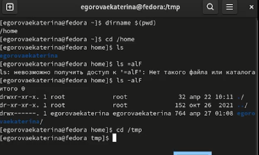
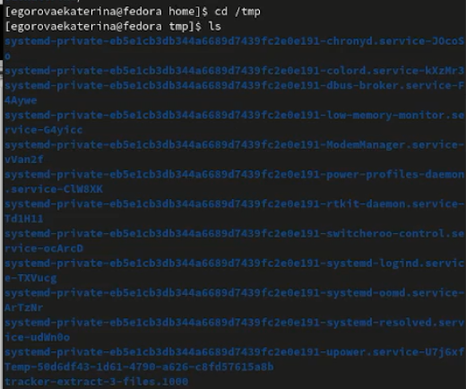
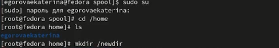
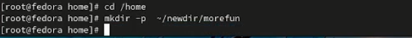
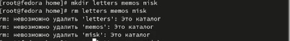
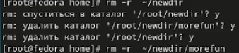
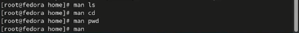
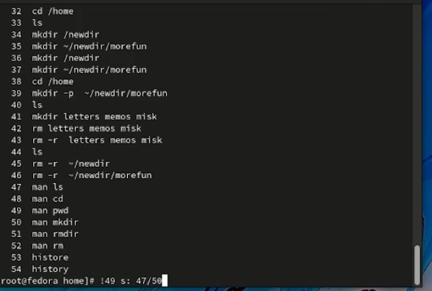

---
## Front matter
lang: ru-RU
title: Structural approach to the deep learning method
author: | Egorova Ekaterina Olegovna
	
institute: |
	\inst{1}RUDN University, Moscow, Russian Federation
	

## Formatting
toc: false
slide_level: 72
theme: metropolis
header-includes: 
 - \metroset{progressbar=frametitle,sectionpage=progressbar,numbering=fraction}
 - '\makeatletter'
 - '\beamer@ignorenonframefalse'
 - '\makeatother'
aspectratio: 43
section-titles: true
---

# Цель работы

Приобретение практических навыков взаимодействия пользователя с системой по cредством командной строки.

## Номер 1

 Определите полное имя вашего домашнего каталога. рис.[-@fig:001]
 
{ #fig:001 width=70% } 
 
## Номер 2

 Перейдите в каталог /tmp.Вывод на экран содержимое каталога /tmp.Для этого используем команду ls с различными опциями. рис.[-@fig:002]

{ #fig:002 width=70% } 

 Переход в домашний каталог рис.[-@fig:003]

{ #fig:003 width=70% } 

## Номер 3

В домашнем каталоге создаем новый каталог с именем newdir.В каталоге ~/newdir создаем новый каталог с именем morefun. рис.[-@fig:004]
                                                              
{ #fig:004 width=70% } 
                                        
В домашнем каталоге создаем одной командойтри новых каталога с именами
letters,memos,misk.Затем удаляем эти каталоги одной командой рис.[-@fig:005]

{ #fig:005 width=70% } 
 
Удаляем ранее созданный каталог ~/newdir командой rm. Удалите каталог ~/newdir/morefun из домашнего каталога рис.[-@fig:006]

{ #fig:006 width=70% } 
 
## Номер 4
С помощью команды man определите, какую опцию команды ls,cd,pwd,mkdir,rmdit,rm для просмотра описания команд рис.[-@fig:007]

{ #fig:007 width=70% } 
 
## Номер 5

Используя информацию,полученную при помощи команды history,выполните модификацию и исполнение нескольких команд из буфера команд. рис.[-@fig:008]

{ #fig:008 width=70% } 

# Вывод
Приобрели  навыки взаимодействия пользователя с системой по cредством командной строки.

