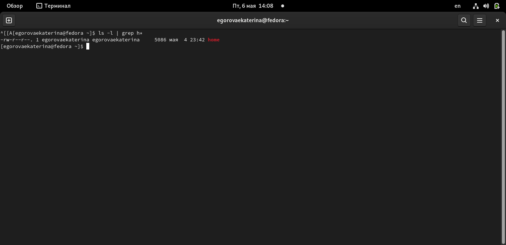

---
## Front matter
title: "Отчёта по лабораторной работе №6"
subtitle: "Дисциплина: операционные системы"
author: "Егорова Екатерина Олеговна "

## Generic otions
lang: ru-RU
toc-title: "Содержание"

## Bibliography
bibliography: bib/cite.bib
csl: pandoc/csl/gost-r-7-0-5-2008-numeric.csl

## Pdf output format
toc: true # Table of contents
toc-depth: 2
lof: true # List of figures
lot: true # List of tables
fontsize: 12pt
linestretch: 1.5
papersize: a4
documentclass: scrreprt
## I18n polyglossia
polyglossia-lang:
  name: russian
  options:
	- spelling=modern
	- babelshorthands=true
polyglossia-otherlangs:
  name: english
## I18n babel
babel-lang: russian
babel-otherlangs: english
## Fonts
mainfont: PT Serif
romanfont: PT Serif
sansfont: PT Sans
monofont: PT Mono
mainfontoptions: Ligatures=TeX
romanfontoptions: Ligatures=TeX
sansfontoptions: Ligatures=TeX,Scale=MatchLowercase
monofontoptions: Scale=MatchLowercase,Scale=0.9
## Biblatex
biblatex: true
biblio-style: "gost-numeric"
biblatexoptions:
  - parentracker=true
  - backend=biber
  - hyperref=auto
  - language=auto
  - autolang=other*
  - citestyle=gost-numeric
## Pandoc-crossref LaTeX customization
figureTitle: "Рис."
tableTitle: "Таблица"
listingTitle: "Листинг"
lofTitle: "Список иллюстраций"
lotTitle: "Список таблиц"
lolTitle: "Листинги"
## Misc options
indent: true
header-includes:
  - \usepackage{indentfirst}
  - \usepackage{float} # keep figures where there are in the text
  - \floatplacement{figure}{H} # keep figures where there are in the text
---

# Цель работы
 Ознакомление с инструментами поиска файлов и фильтрации текстовых данных.
Приобретение практических навыков: по управлению процессами (и заданиями), по
проверке использования диска и обслуживанию файловых систем.
# Задание

1. Осуществите вход в систему,используя соответствующее имя пользователя.
2. Запишите в файл file.txt названия файлов,содержащихся в каталоге /etc.Допи-
шите в этот же файл названия файлов,содержащихся в вашем домашнем каталоге.
3. Выведите имена всех файлов из file.txt,имеющих расширение .conf,после чего
запишите их в новыйтекстовой файл conf.txt.
4. Определите,какие файлы в вашем домашнем каталоге имеют имена,начинавшиеся
с символа c? Предложите несколько вариантов,как это сделать.
5. Выведите на экран (по странично) имена файлов из каталога /etc,начинающиеся
с символа h.
6. Запустите в фоновом режиме процесс,который будетзаписывать в файл ~/logfile
файлы,имена которых начинаются с log.
7. Удалите файл ~/logfile.
8. Запустите из консоли в фоновом режиме редактор gedit.
9. Определитеидентификаторпроцессаgedit,используякомандуps,конвейерифильтр
grep.Как ещё можно определить идентификатор процесса?
10. Прочтите справку (man) команды kill, после чего используйте её для завершения
процесса gedit.
11. Выполните команды df и du,предварительно получив более подробную информацию
об этих командах,с помощью команды man.
12. Воспользовавшись справкой команды find,выведите имена всех директорий,имею-
щихся в вашем домашнем каталоге.
# Выполнение лабораторной работы

1.  Осуществляю вход в систему,используя соответствующее имя пользователя. Запишисываю в файл file.txt названия файлов,содержащихся в каталоге /etc.Допишите в этот же файл названия файлов,содержащихся в вашем домашнем каталоге. рис.[-@fig:001]
 
{ #fig:001 width=70% } 

2. Вывожу имена всех файлов из file.txt,имеющих расширение .conf,после чего
записываю их в новый текстовой файл conf.txt рис.[-@fig:002]  рис.[-@fig:003]
 
{ #fig:002 width=70% } 

{ #fig:003 width=70% } 
 3. Определю какие файлы в домашнем каталоге имеют имена,начинавшиеся
с символа c рис.[-@fig:004]
 { #fig:004 width=70% } 

 4. Вывожу на экран (по странично) имена файлов из каталога /etc,начинающиеся
с символа h. рис.[-@fig:005]
 
 { #fig:005 width=70% } 

 5. Запускаю в фоновом режиме процесс,который будет записывать в файл ~/logfile
файлы,имена которых начинаются с log. рис.[-@fig:006]

{ #fig:006 width=70% } 

6. Удаляю файл ~/logfile.рис.[-@fig:007]
 
{ #fig:007 width=70% } 

7.  Запускаю из консоли в фоновом режиме редактор gedit. рис.[-@fig:008]
 
{ #fig:008 width=70% } 

8. Опредяю идентификатор процесса gedit,используякоманду ps,конвейер и фильтр
grep рис.[-@fig:009]
 { #fig:009 width=70% } 

9. Прочитываю справку (man) команды kill, после чего используйте её для завершения
процесса gedit Рис.[-@fig:010] Рис.[-@fig:011]
 { #fig:010 width=70% } 
{ #fig:011 width=70% } 

 10. Выполняю команды df и du,предварительно получив более подробную информацию
об этих командах,с помощью команды man. Рис.[-@fig:012] Рис.[-@fig:013] рис.[-@fig:014] Рис.[-@fig:015]
 { #fig:012 width=70% }
 { #fig:013 width=70% }
{ #fig:014 width=70% } 
{ #fig:015 width=70% } ]

 11. Воспользовавшись справкой команды find,вывожу имена всех директорий,имею-
щихся в домашнем каталоге Рис.[-@fig:016]
 { #fig:016 width=70% } 

 
# Контрольные вопросы
В системе по умолчанию открытотри специальных потока:
– stdin —стандартныйпотокввода(поумолчанию:клавиатура),файловыйдескриптор
0;
– stdout —стандартный поток вывода (по умолчанию: консоль),файловый дескриптор
1;
– stderr —стандартный поток вывод сообщений об ошибках (по умолчанию: консоль),
файловый дескриптор 2. > : Перезаписывает существующий файл или создает файл, если файл с указанным именем отсутствует в каталоге.>> : добавляет существующий файл или создает файл, если файл с указанным именем отсутствует в каталоге.
Конвейер (pipe) служитдля объединения простых команд или утилит в цепочки,в ко-
торых результат работы предыдущей команды передаётся последующей.
одна программа может вызывать несколько процессов или, другими словами, несколько процессов могут быть частью одной и той же программы.
Эффективное имя пользователя Linux или Unix и эффективный идентификатор пользователя (UID) Имя действующей группы пользователей Linux или Unix и идентификатор эффективной группы (GID)Утилиты top, htop, atop для просмотра запущенных процессов в Linux и FreeBSD.
Для поиска файла по содержимому проще всего воспользоваться командой grep (вместо find).
grep -r строка_поиска каталог
команда df -определить объем свободной памяти на жёстком диске
 du -определить объем вашего домашнего каталога 
 kill-удалить зависший процесс
# Вывод
Ознакомилась с инструментами поиска файлов и фильтрации текстовых данных.
Приобрела практические навыки: по управлению процессами (и заданиями), по
проверке использования диска и обслуживанию файловых систем.
