---
## Front matter
title: "Отчёта по лабораторной работе №6"
subtitle: "Дисциплина: операционные системы"
author: "Егорова Екатерина Олеговна "

## Generic otions
lang: ru-RU
toc-title: "Содержание"

## Bibliography
bibliography: bib/cite.bib
csl: pandoc/csl/gost-r-7-0-5-2008-numeric.csl

## Pdf output format
toc: true # Table of contents
toc-depth: 2
lof: true # List of figures
lot: true # List of tables
fontsize: 12pt
linestretch: 1.5
papersize: a4
documentclass: scrreprt
## I18n polyglossia
polyglossia-lang:
  name: russian
  options:
	- spelling=modern
	- babelshorthands=true
polyglossia-otherlangs:
  name: english
## I18n babel
babel-lang: russian
babel-otherlangs: english
## Fonts
mainfont: PT Serif
romanfont: PT Serif
sansfont: PT Sans
monofont: PT Mono
mainfontoptions: Ligatures=TeX
romanfontoptions: Ligatures=TeX
sansfontoptions: Ligatures=TeX,Scale=MatchLowercase
monofontoptions: Scale=MatchLowercase,Scale=0.9
## Biblatex
biblatex: true
biblio-style: "gost-numeric"
biblatexoptions:
  - parentracker=true
  - backend=biber
  - hyperref=auto
  - language=auto
  - autolang=other*
  - citestyle=gost-numeric
## Pandoc-crossref LaTeX customization
figureTitle: "Рис."
tableTitle: "Таблица"
listingTitle: "Листинг"
lofTitle: "Список иллюстраций"
lotTitle: "Список таблиц"
lolTitle: "Листинги"
## Misc options
indent: true
header-includes:
  - \usepackage{indentfirst}
  - \usepackage{float} # keep figures where there are in the text
  - \floatplacement{figure}{H} # keep figures where there are in the text
---

# Цель работы
 Освоение основных возможностей командной оболочки Midnight Commander. Приобретение навыков практической работы по просмотру каталогов и файлов; манипуляций
с ними.

# Задание по mc
1. Изучите информацию о mc, вызвав в командной строке man mc.
2. Запустите из командной строки mc, изучите его структуру и меню.
3. Выполните несколько операций в mc, используя управляющие клавиши (операции с панелями; выделение/отмена выделения файлов, копирование/перемещение файлов, получение информации о размере и правах доступа на файлы и/или каталоги
и т.п.)
4. Выполните основные команды меню левой (или правой) панели. Оцените степень
подробности вывода информации о файлах.
5. Используя возможности подменю Файл , выполните:
– просмотр содержимого текстового файла;
– редактирование содержимого текстового файла (без сохранения результатов
редактирования);
– создание каталога;
– копирование в файлов в созданный каталог.
6. С помощью соответствующих средств подменю Команда осуществите:
– поиск в файловой системе файла с заданными условиями (например, файла
с расширением .c или .cpp, содержащего строку main);
– выбор и повторение одной из предыдущих команд;
– переход в домашний каталог;
– анализ файла меню и файла расширений.
7. Вызовите подменю Настройки . Освойте операции, определяющие структуру экрана mc
(Full screen, Double Width, Show Hidden Files и т.д.)
# Задание по встроенному редактору mc
1. Создайте текстовой файл text.txt.
2. Откройте этот файл с помощью встроенного в mc редактора.
3. Вставьте в открытый файл небольшой фрагмент текста, скопированный из любого
другого файла или Интернета.
4. Проделайте с текстом следующие манипуляции, используя горячие клавиши:
4.1. Удалите строку текста.
4.2. Выделите фрагмент текста и скопируйте его на новую строку.

# Выполнение лабораторной работы
# 1 Этап
1. Изучила информацию о mc, вызвав в командной строке man mc. рис.[-@fig:001]
 
{ #fig:001 width=70% } 
 
2. Запустила из командной строки mc, изучите его структуру и меню. рис [-@fig:002]
{ #fig:002 width=70% } 
3. Выполнила несколько операций в mc, используя управляющие клавиши (операции с панелями; выделение/отмена выделения файлов, копирование/перемещение файлов, получение информации о размере и правах доступа на файлы и/или каталоги
и т.п.) рис [-@fig:003] 

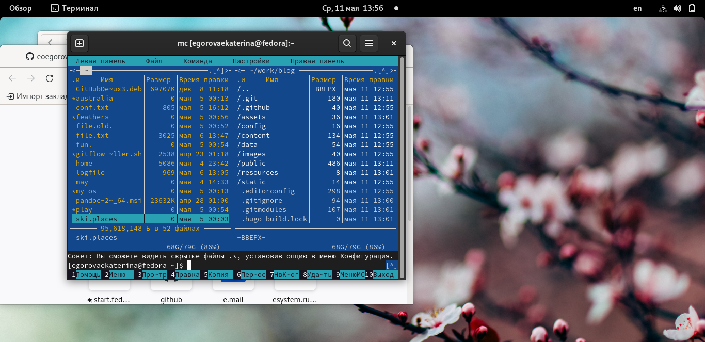{ #fig:003 width=70% } 
4. Выполнила основные команды меню левой (или правой) панели. Оценила степень
подробности вывода информации о файлах. рис [-@fig:004]  рис [-@fig:005] 
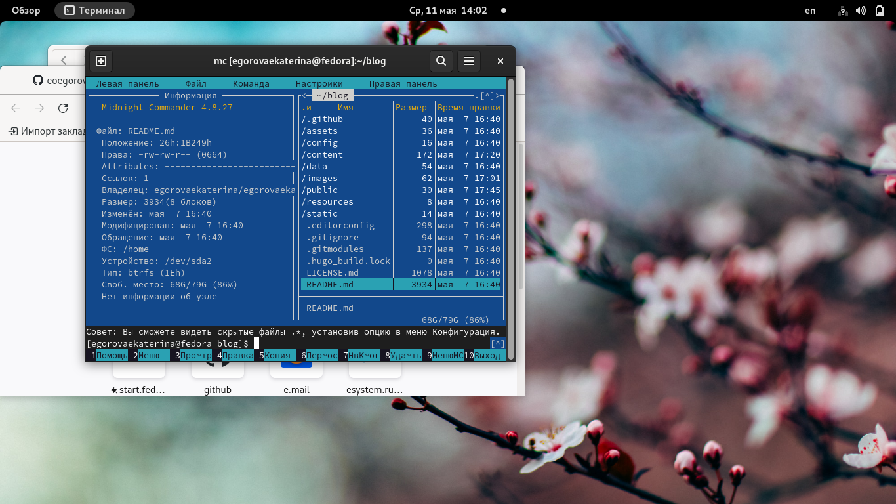{ #fig:004 width=70% } 
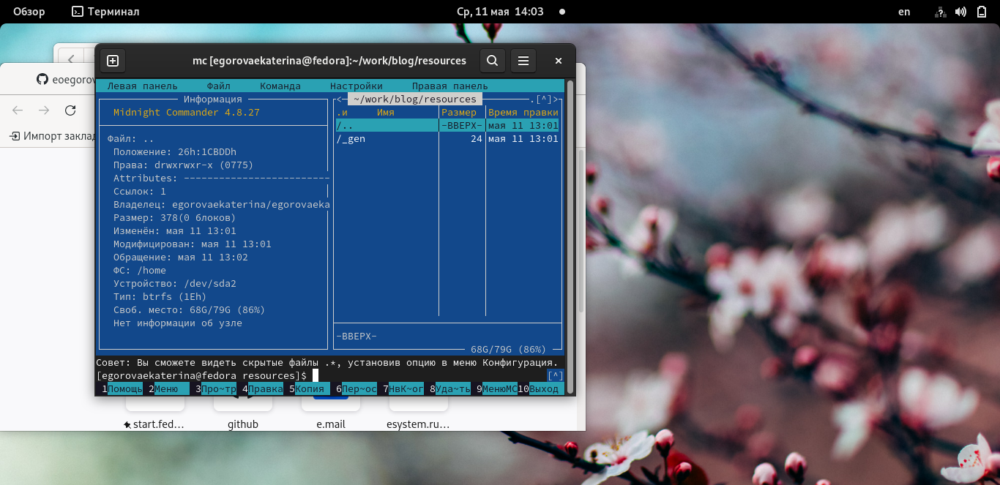{ #fig:005 width=70% } 
5. Используя возможности подменю Файл , выполнила:
– просмотр содержимого текстового файла; рис [-@fig:006] 
– редактирование содержимого текстового файла (без сохранения результатов редактирования);рис [-@fig:007] 
– создание каталога; рис [-@fig:008] 
– копирование  файлов в созданный каталог.рис [-@fig:009] 

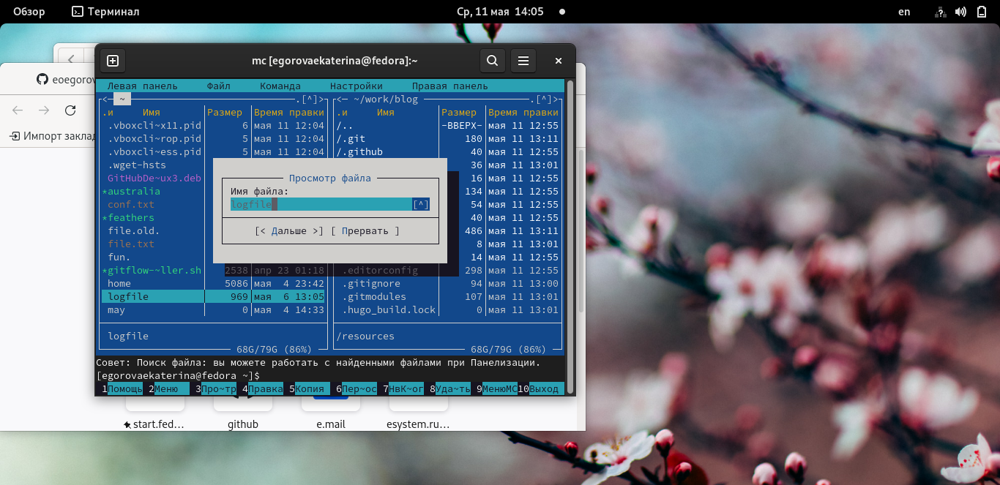{ #fig:006 width=70% } 
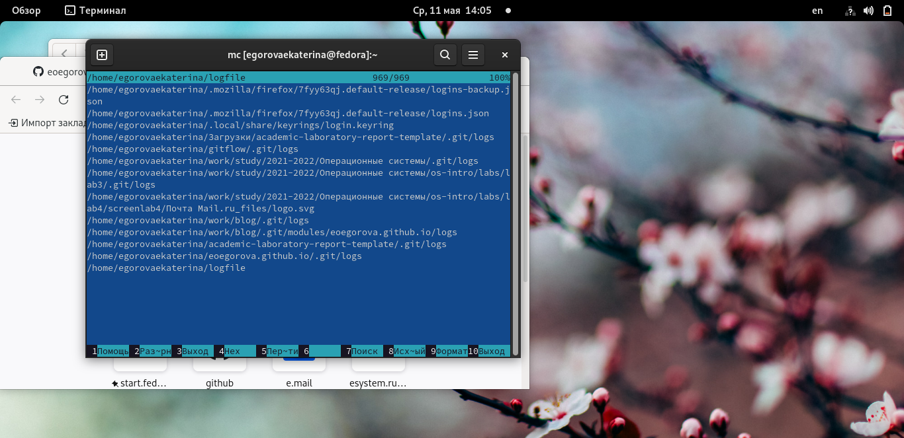{ #fig:007 width=70% } 

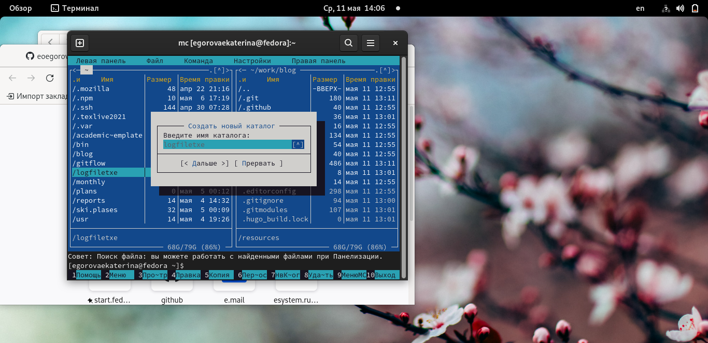{ #fig:008 width=70% } 

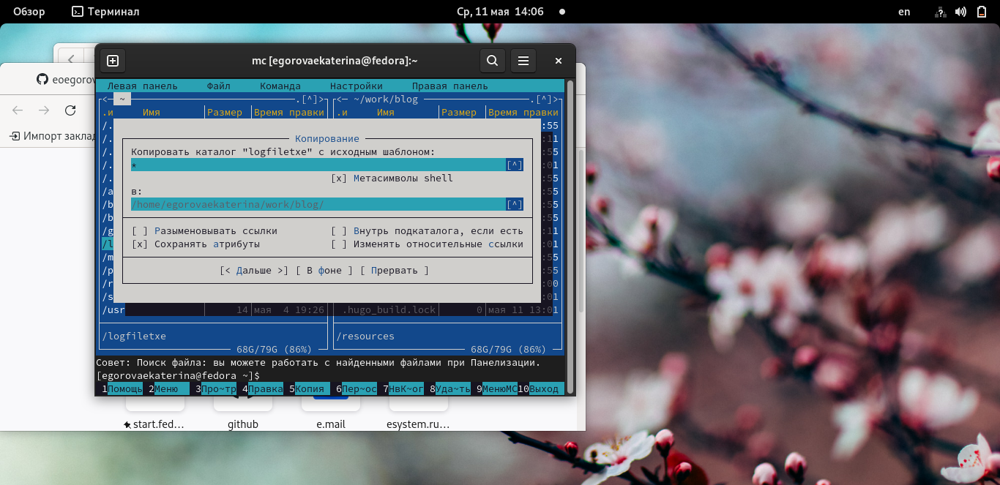{ #fig:009 width=70% } 

6. С помощью соответствующих средств подменю Команда осуществила:
– поиск в файловой системе файла с заданными условиями (например, файла рис [-@fig:010] 
с расширением .c или .cpp, содержащего строку main);рис [-@fig:011] 
– выбор и повторение одной из предыдущих команд;
– переход в домашний каталог; рис [-@fig:012]
– анализ файла меню и файла расширений. рис [-@fig:013]

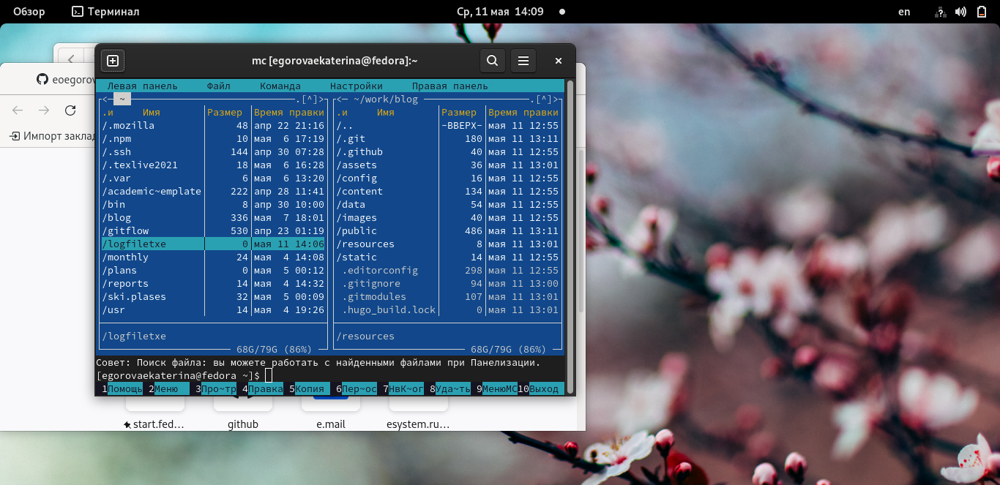{ #fig:010 width=70% } 
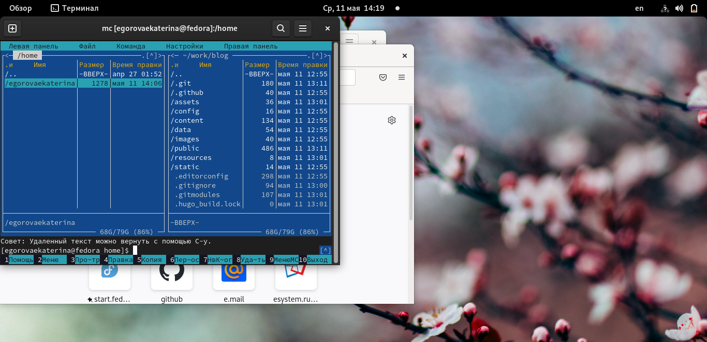{ #fig:011 width=70% } 
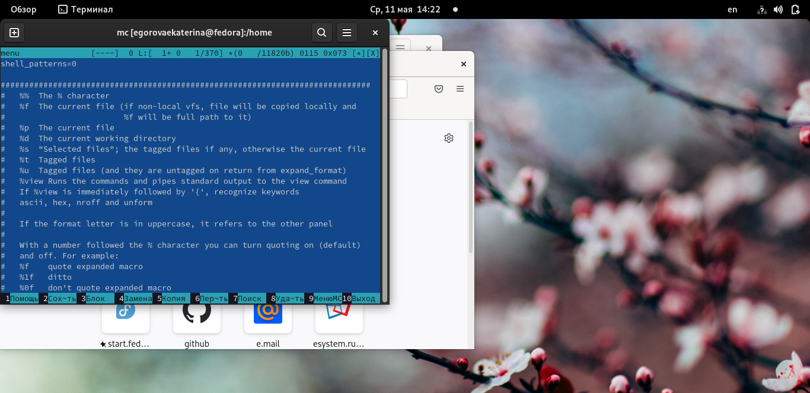{ #fig:012 width=70% } 
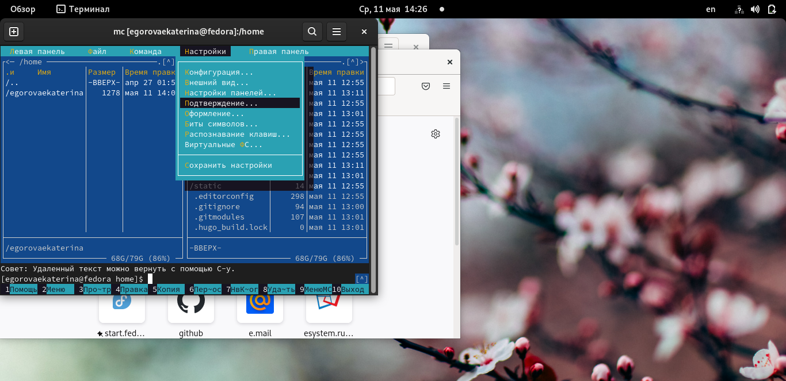{ #fig:013 width=70% } 

7. Вызвала подменю Настройки . Освоила операции, определяющие структуру экрана mc
(Full screen, Double Width, Show Hidden Files и т.д.)

# 2 Этап

1. Создала текстовой файл text.txt. рис [-@fig:014]

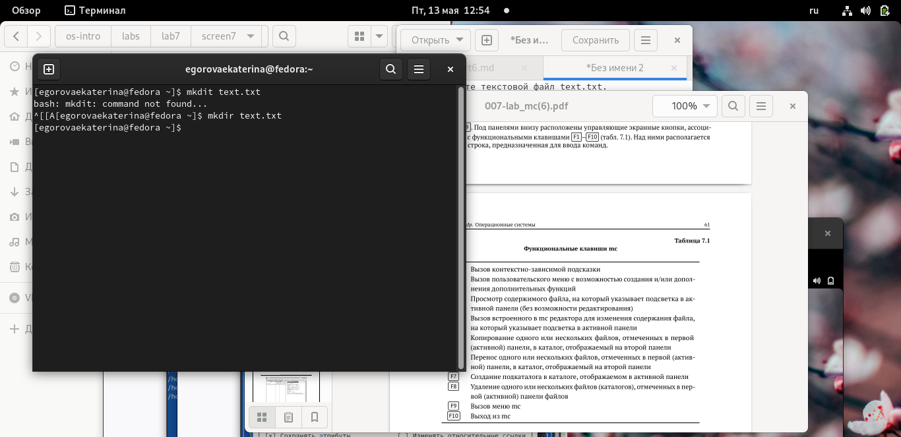{ #fig:014 width=70% } 

2. Открыла этот файл с помощью встроенного в mc редактора. рис [-@fig:015]

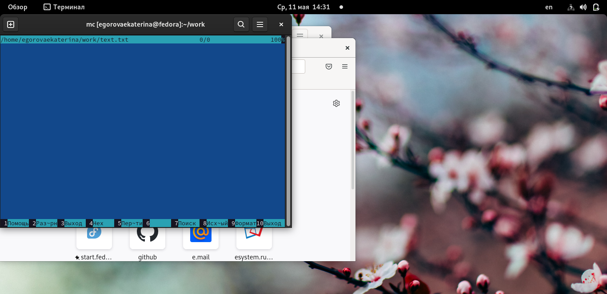{ #fig:015 width=70% } 

3. Вставила в открытый файл небольшой фрагмент текста, скопированный из любого другого файла или Интернета. рис [-@fig:016]

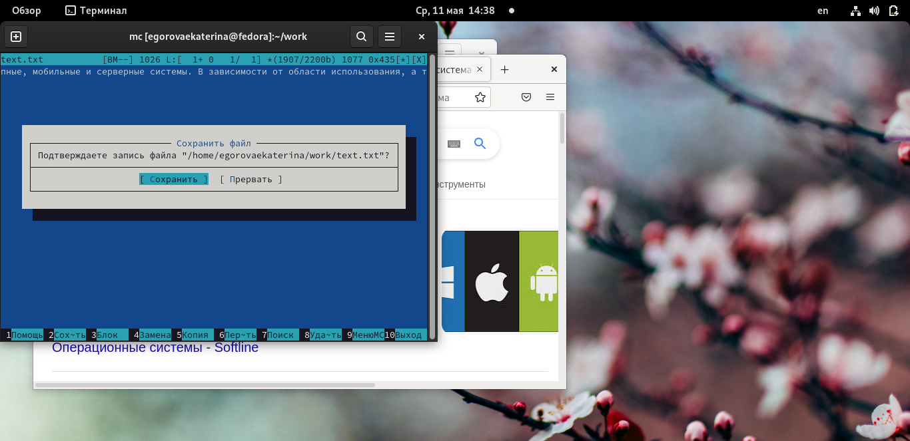{ #fig:016 width=70% } 

4. Проделала с текстом следующие манипуляции, используя горячие клавиши: рис [-@fig:017]

4.1. Удалила строку текста.
4.2. Выделила фрагмент текста и скопируйте его на новую строку.

{ #fig:017 width=70% } 

# Контрольные вопросы
 Экран MC делится на четыре части. Почти весь зкран занят двумя панелями. По умолчанию, вторая строка снизу является командной, а в самой нижней отображается назначение функциональных клавиш. Самая верхняя строка - строка меню. Она может быть не видна, но при нажатии клавиши F9 или при щелчке мыши эта строка отображается в верхней части экрана 
MC позволяет одновременно наблюдать содержимое двух каталогов. Одна из панелей является текущей (в этой панели находится выделитель). Практически все команды оперируют над текущей панелью. Хотя некоторые файловые операции, такие как Rename или Copy, по умолчанию используют каталог неактивной панели в качестве каталога назначения (при выполнении подобных команд всегда появляется запрос на подтверждение). Для более подробной информации просмотрите разделы 'ПАНЕЛИ', 'МЕНЮ Left', 'МЕНЮ Right' и 'МЕНЮ File'.
Можно выполнять системные команды прямо из MC просто путём их набора на клавиатуре. Всё, что Вы набираете, появляется в командной строке, а при нажатии клавиши Enter, MC выполнит набранную строку. Просмотрите разделы 'КОМАНДНАЯ СТРОКА' и 'КЛАВИШИ РЕДАКТИРОВАНИЯ' для более подробной информации. 
Команды меню Файл :
– Просмотр ( F3 ) — позволяет посмотреть содержимое текущего (или выделенного)
файла без возможности редактирования.
– Просмотр вывода команды ( М + ! ) — функция запроса команды с параметрами
(аргумент к текущему выбранному файлу).
– Правка ( F4 ) — открывает текущий (или выделенный) файл для его редактирования.
– Копирование ( F5 ) — осуществляет копирование одного или нескольких файлов или
каталогов в указанное пользователем во всплывающем окне место.
– Права доступа ( Ctrl-x c ) — позволяет указать (изменить) права доступа к одному
или нескольким файлам или каталогам (рис. 7.7).
– Жёсткая ссылка ( Ctrl-x l ) — позволяет создать жёсткую ссылку к текущему (или
выделенному) файлу1 .
– Символическая ссылка ( Ctrl-x s ) — позволяет создать символическую ссылку к теку-
щему (или выделенному) файлу2 .
– Владелец/группа ( Ctrl-x o ) — позволяет задать (изменить) владельца и имя группы
для одного или нескольких файлов или каталогов.
– Права (расширенные) — позволяет изменить права доступа и владения для одного
или нескольких файлов или каталогов.
– Переименование ( F6 ) — позволяет переименовать (или переместить) один или
несколько файлов или каталогов.
– Создание каталога ( F7 ) — позволяет создать каталог.
– Удалить ( F8 ) — позволяет удалить один или несколько файлов или каталогов.
– Выход ( F10 ) — завершает работу mc.
Меню Команда
В меню Команда содержатся более общие команды для работы с mc (рис. 7.8).
Команды меню Команда :
– Дерево каталогов — отображает структуру каталогов системы.
– Поиск файла — выполняет поиск файлов по заданным параметрам.
– Переставить панели — меняет местами левую и правую панели.
– Сравнить каталоги ( Ctrl-x d ) — сравнивает содержимое двух каталогов.
– Размеры каталогов — отображает размер и время изменения каталога (по умолчанию
в mc размер каталога корректно не отображается).
– История командной строки — выводит на экран список ранее выполненных в оболочке
команд.
– Каталоги быстрого доступа ( Ctrl-\ ) — пр вызове выполняется быстрая смена текущего
каталога на один из заданного списка.
– Восстановление файлов — позволяет восстановить файлы на файловых системах ext2
и ext3.
– Редактировать файл расширений — позволяет задать с помощью определённого син-
таксиса действия при запуске файлов с определённым расширением (например, какое
программного обеспечение запускать для открытия или редактирования файлов с рас-
ширением doc или docx).
– Редактировать файл меню — позволяет отредактировать контекстное меню пользова-
теля, вызываемое по клавише F2 .
– Редактировать файл расцветки имён — позволяет подобрать оптимальную для поль-
зователя расцветку имён файлов в зависимости от их типа.
Меню Настройки
Меню Настройки содержит ряд дополнительных опций по внешнему виду и функцио-
нальности mc (рис. 7.9).
Меню Настройки содержит:
– Конфигурация — позволяет скорректировать настройки работы с панелями.
– Внешний вид и Настройки панелей — определяет элементы (строка меню, команд-
ная строка, подсказки и прочее), отображаемые при вызове mc, а также геометрию
расположения панелей и цветовыделение.
– Биты символов — задаёт формат обработки информации локальным терминалом.
– Подтверждение — позволяет установить или убрать вывод окна с запросом подтвер-
ждения действий при операциях удаления и перезаписи файлов, а также при выходе
из программы.
– Распознание клавиш — диалоговое окно используется для тестирования функцио-
нальных клавиш, клавиш управления курсором и прочее.
– Виртуальные ФС –– настройки виртуальной файловой системы: тайм-аут, пароль
и прочее.
Встроенный в mc редактор вызывается с помощью функциональной клавиши F4 . В нём
удобно использовать различные комбинации клавиш при редактировании содержимого
(как правило текстового) файла (табл. 7.2).
Меню пользователя – это меню, состоящее из команд, определенных пользователем. При вызове меню используется файл ~/.mc.menu. re
# Вывод
Освоила основных возможностей командной оболочки Midnight Commander. Приобретение навыков практической работы по просмотру каталогов и файлов; манипуляций
с ними.
