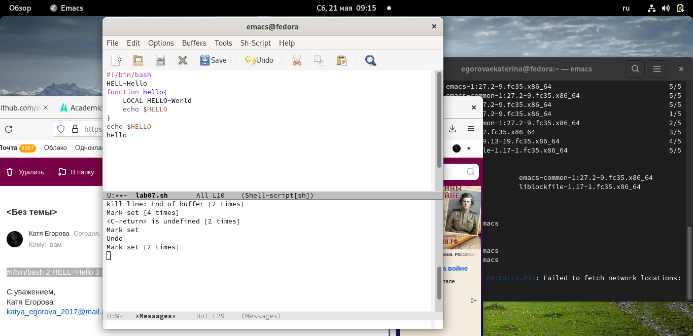
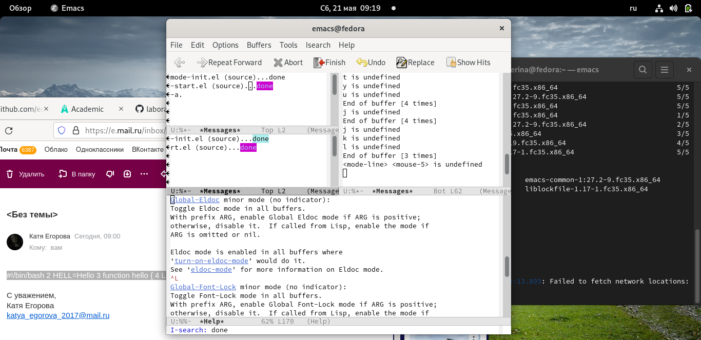

---
## Front matter
lang: ru-RU
title: Structural approach to the deep learning method
author: | Egorova Ekaterina Olegovna
	
institute: |
	\inst{1}RUDN University, Moscow, Russian Federation
	

## Formatting
toc: false
slide_level: 72
theme: metropolis
header-includes: 
 - \metroset{progressbar=frametitle,sectionpage=progressbar,numbering=fraction}
 - '\makeatletter'
 - '\beamer@ignorenonframefalse'
 - '\makeatother'
aspectratio: 43
section-titles: true

# Цель работы
Познакомиться с операционной системой Linux. Получить практические навыки работы с редактором Emacs.

# Выполнение лабораторной работы

## создание файла и набор текста
 
  Создать файл lab07.sh с помощью комбинации Ctrl-x Ctrl-f (C-x C-f). Наберите текст рис.[-@fig:001]
 
{ #fig:001 width=70% } 

## сохранение файла 
 Сохранить файл с помощью комбинации Ctrl-x Ctrl-s (C-x C-s).рис.[-@fig:002]
 
 { #fig:002 width=70% } 
 
 
## вырезаю строку
Вырезать одной командой целую строку (С-k). рис.[-@fig:003]
 { #fig:003 width=70% } 
 
## вставляю строку

 Вставить эту строку в конец файла (C-y). рис.[-@fig:004]
 { #fig:003 width=70% } 
 
## выделяю область

  Выделить область текста (C-space).Вставить область в конец файла. рис.[-@fig:005]
 { #fig:005 width=70% }

## выледеляю область 
 
 Вновь выделить эту область и на этот раз вырезать её (C-w). рис.[-@fig:006]
{ #fig:006 width=70% }

## выледеляю область 

  Отмените последнее действие (C-/). рис.[-@fig:007]
 { #fig:007 width=70% }

##  перемесила курсор  в конец строки 

Переместите курсор в конец строки (C-e).рис.[-@fig:007]
 { #fig:008 width=70% }

##   переместила курсор в конец буфера  

 Переместите курсор в конец буфера (M->).рис.[-@fig:007]
 { #fig:009 width=70% }

## вывела список  активных буферов   

 Вывести список активных буферов на экран (C-x C-b).рис.[-@fig:010]
 { #fig:010 width=70% }

## переключаюсь на другой буфер 

. Переместитесь во вновь открытое окно (C-x) o со списком открытых буферов
и переключитесь на другой буфер.рис.[-@fig:011]
 { #fig:011 width=70% }

## переключаюсь между буферами 
. Закройте это окно (C-x 0).Теперь вновь переключайтесь между буферами, но уже без вывода их списка на
экран (C-x b).рис.[-@fig:012]
 { #fig:012 width=70% }

## выледеляю область 

. Поделите фрейм на 4 части: разделите фрейм на два окна по вертикали (C-x 3),
а затем каждое из этих окон на две части по горизонтали (C-x 2) рис.[-@fig:013]
 { #fig:013 width=70% }
## выледеляю область 
 рис.[-@fig:014]
 { #fig:014 width=70% }

## открываю новый буфер

 В каждом из четырёх созданных окон откройте новый буфер (файл) и введите
несколько строк текста.рис.[-@fig:015]
 { #fig:015 width=70% }

## нахожу слова

. Переключитесь в режим поиска (C-s) и найдите несколько слов, присутствующих
в тексте. рис.[-@fig:016]
 { #fig:015 width=70% }
# Контрольные вопросы

1. Emacs представляет собой мощный экранный редактор текста, написанный на языке
высокого уровня Elisp.

2. Для запуска Emacs необходимо в командной строке набрать emacs (или emacs & для
работы в фоновом режиме относительно консоли).
Для работы с Emacs можно использовать как элементы меню, так и различные со-
четания клавиш. Например, для выхода из Emacs можно воспользоваться меню File
и выбрать пункт Quit , а можно нажать последовательно Ctrl-x Ctrl-c (в обозначениях
Emacs: C-x C-c).Многие рутинные операции в Emacs удобнее производить с помощью клавиатуры, а не
графического меню. Наиболее часто в командах Emacs используются сочетания c клави-
шами Ctrl и Meta (в обозначениях Emacs: C- и M-; клавиша Shift в Emasc обозначается
как S-). Так как на клавиатуре для IBM PC совместимых ПК клавиши Meta нет, то вместо
неё можно использовать Alt или Esc . Для доступа к системе меню используйте клавишу
F10 .
Клавиши Ctrl , Meta и Shift принято называть префиксными. Например, запись M-x
означает, что надо удерживая клавишу Meta (или Alt ), нажать на клавишу x. Для открытия
файла следует использовать команду C-x C-f (надо, удерживая клавишу Ctrl , нажать на
клавишу x , затем отпустить обе клавиши и снова, удерживая клавишу Ctrl , нажать на
клавишу f ).
По назначению префиксные сочетания клавиш различаются следующим образом:
– C-x — префикс ввода основных команд редактора (например, открытия, закрытии,
сохранения файла и т.д.);
– C-c — префикс вызова функций, зависящих от используемого режима.

3. Буфер - это основая еденица редактирования. Может быть использовано  несколько окон
Окно -область экрана, в которой отображается буфер.
4. Можно ли открыть больше 10 буферов в одном окне?- да,можно .
5. '*scratch*'
6. с-x 2( поделить текущее окно на две части)
7. Настройки emacs хранятся в файле .emacs, который хранится в домашней дирректории пользователя. 
8. Для меня оказался удобнее редактор vi, т.к он понятнее и редактирование файла очень простое . 

# Вывод
Познакомилась с операционной системой Linux. Получила практические навыки работы с редактором Emacs

