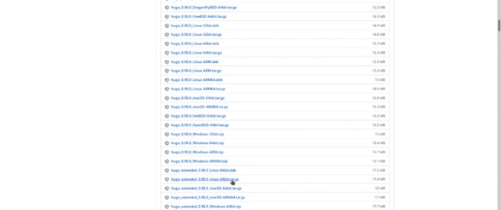
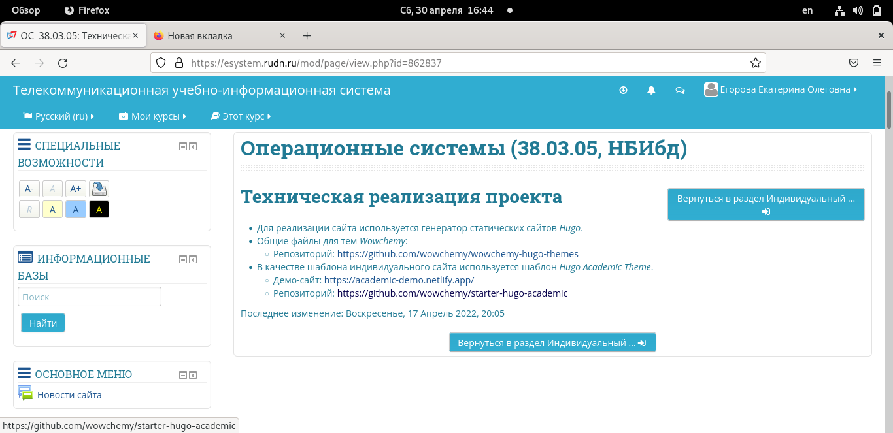
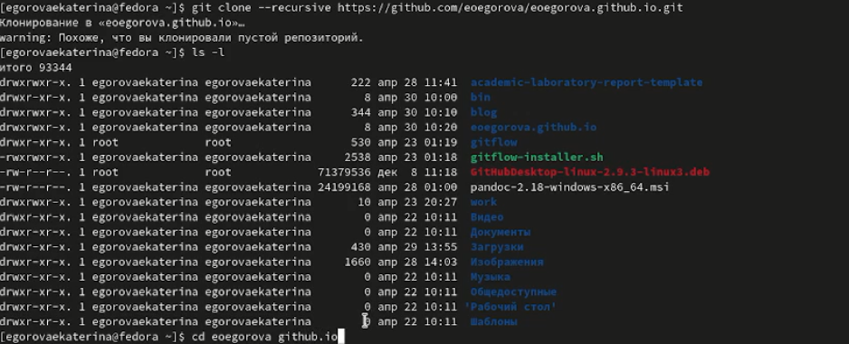
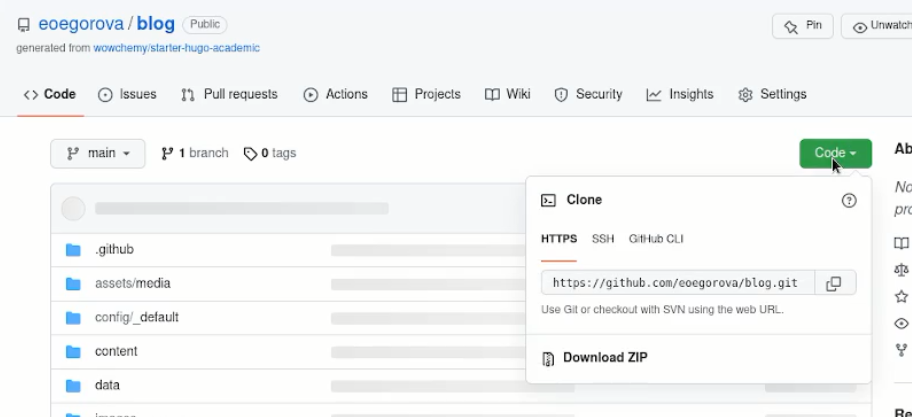
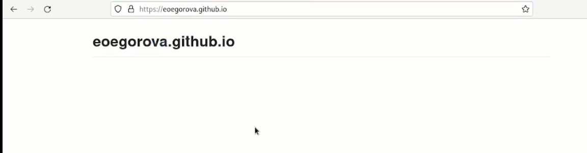

---
## Front matter
lang: ru-RU
title: Structural approach to the deep learning method
author: | Egorova Ekaterina Olegovna
	
institute: |
	\inst{1}RUDN University, Moscow, Russian Federation
	

## Formatting
toc: false
slide_level: 21
theme: metropolis
header-includes: 
 - \metroset{progressbar=frametitle,sectionpage=progressbar,numbering=fraction}
 - '\makeatletter'
 - '\beamer@ignorenonframefalse'
 - '\makeatother'
aspectratio: 43
section-titles: true
---

# Цель работы

 Размещение на Github pages заготовки для персонального сайта.

# Задание

   -  Установить необходимое программное обеспечение.
  - Скачать шаблон темы сайта.
   -  Разместить его на хостинге git.
    Установить параметр для URLs сайта.
    Разместить заготовку сайта на Github pages.
# Установка программного обеспечения
1.  Устанавливаю необходимое программное обеспечение рис.[-@fig:001]

{ #fig:001 width=70% } 
## Cкачивание шаблона 
   
  2. Скачиваю шаблон темы сайта. рис.[-@fig:002]

{ #fig:001 width=70% } 
## Размещение на хостинге

3. Размещаю его на хостинге git.рис.[-@fig:003]

{ #fig:001 width=70% } 
## Установка параметров

 4. Устанавливаю параметр для URLs сайта.рис.[-@fig:004]
 
 { #fig:001 width=70% } 

## Размещение загатовки сайта
 5. Размещаю заготовку сайта на Github pages.рис.[-@fig:005]
 
 { #fig:001 width=70% } 
# Вывод

Научились оформлять отчеты с помощью языка разметки Markdown

