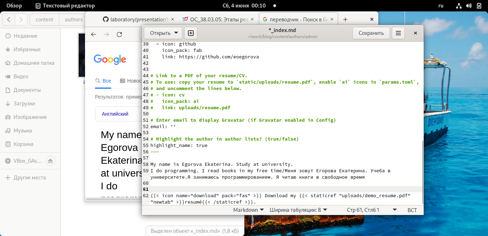
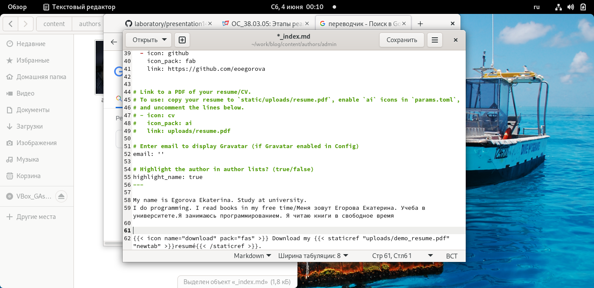
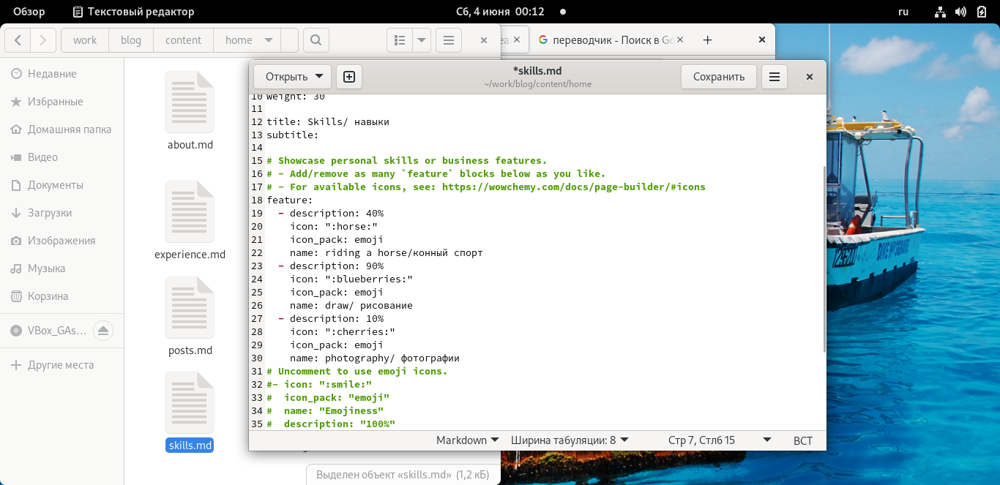
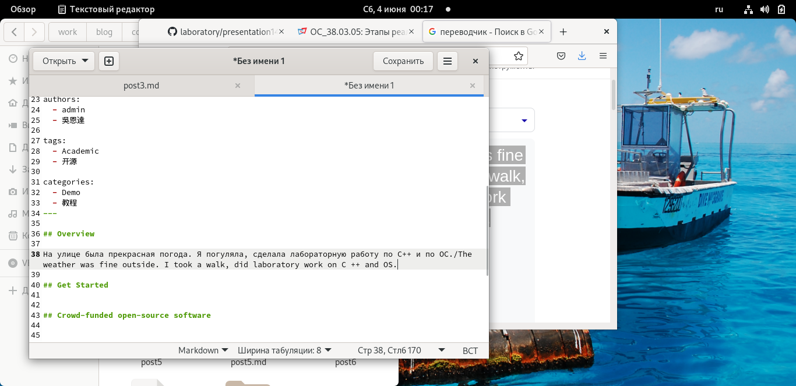
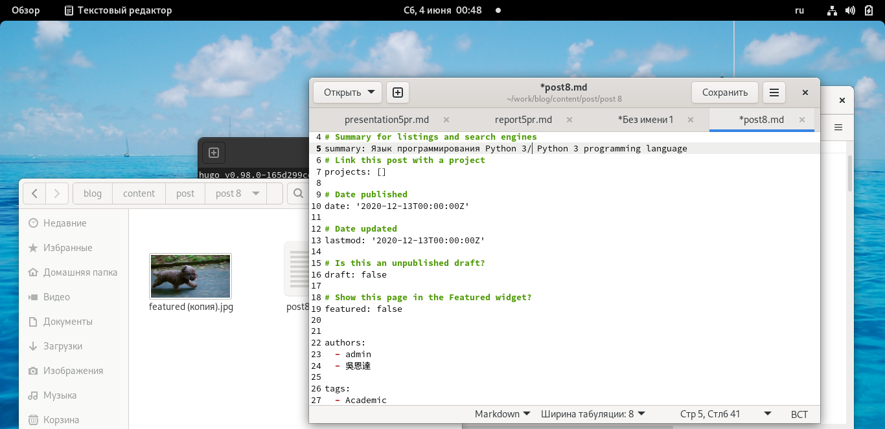
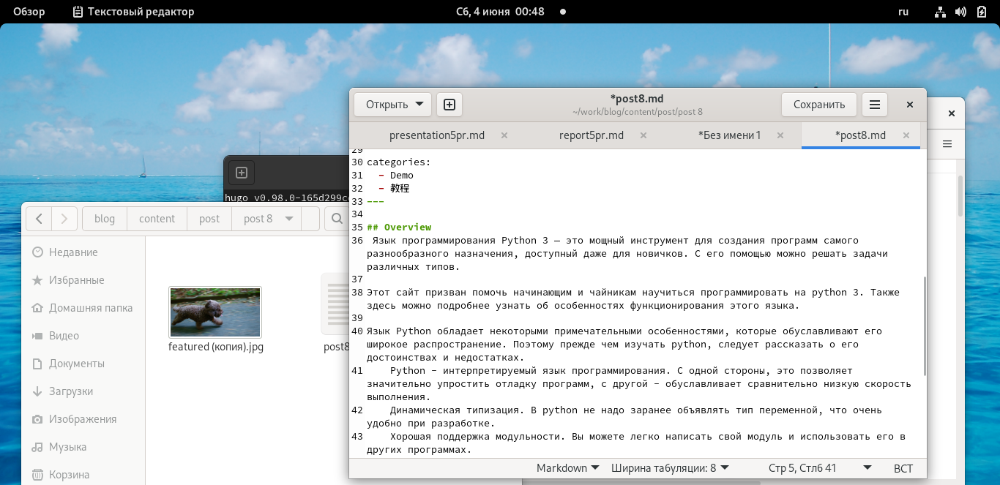

---
## Front matter
lang: ru-RU
title: Structural approach to the deep learning method
author: | Egorova Ekaterina Olegovna
	
institute: |
	\inst{1}RUDN University, Moscow, Russian Federation
	

## Formatting
toc: false
slide_level: 21
theme: metropolis
header-includes: 
 - \metroset{progressbar=frametitle,sectionpage=progressbar,numbering=fraction}
 - '\makeatletter'
 - '\beamer@ignorenonframefalse'
 - '\makeatother'
aspectratio: 43
section-titles: true
---
# Цель работы

  
Размещение двуязычного сайта на Github.
# Задание

Размещение двуязычного сайта на Github.

    Сделать поддержку английского и русского языков.
    Разместить элементы сайта на обоих языках.
    Разместить контент на обоих языках.
    Сделать пост по прошедшей неделе.
    Добавить пост на тему по выбору.

    
# Выполнение работы

## Сделала  поддержку английского и русского языков.

 рис.[-@fig:001]
 
{ #fig:001 width=70% } 

рис.[-@fig:002]

{ #fig:002 width=70% } 

рис.[-@fig:003] 

{ #fig:003 width=70% } 

## Пост по прошедшей неделе. 

рис.[-@fig:004]

{ #fig:004 width=70% } 

##  Добавила пост на тему по выбору.

рис.[-@fig:005]

{ #fig:005 width=70% } 

рис.[-@fig:006]

{ #fig:006 width=70% }

# Вывод

Размеcтила двуязычного сайта на Github.

 

