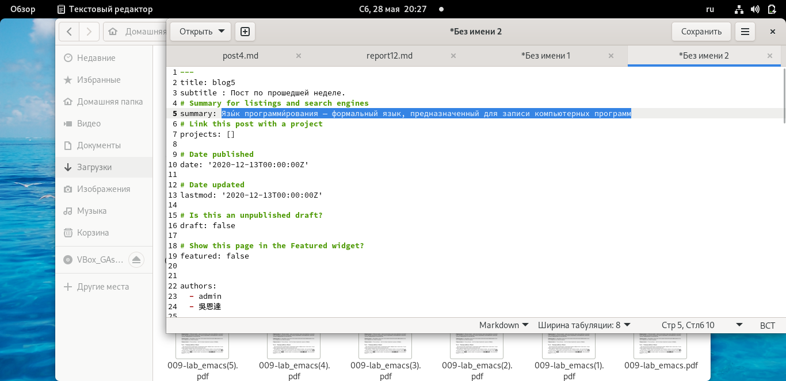
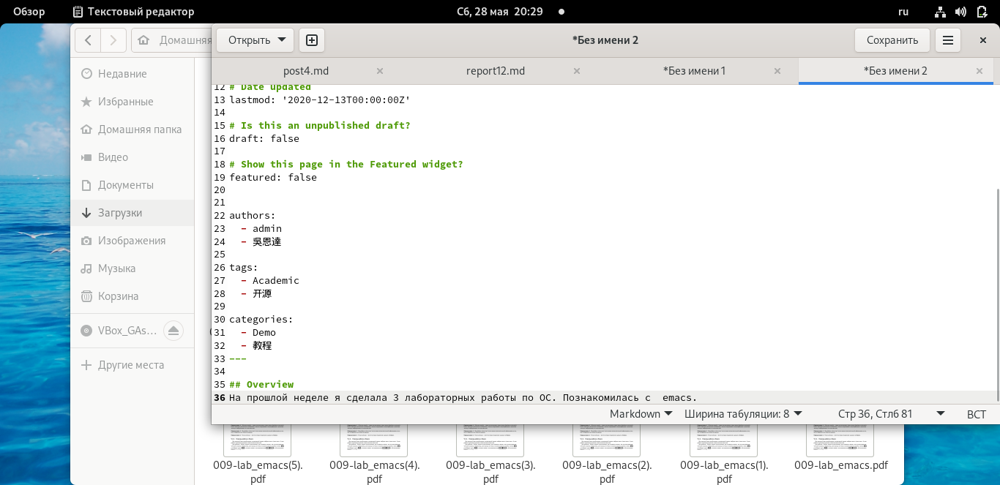
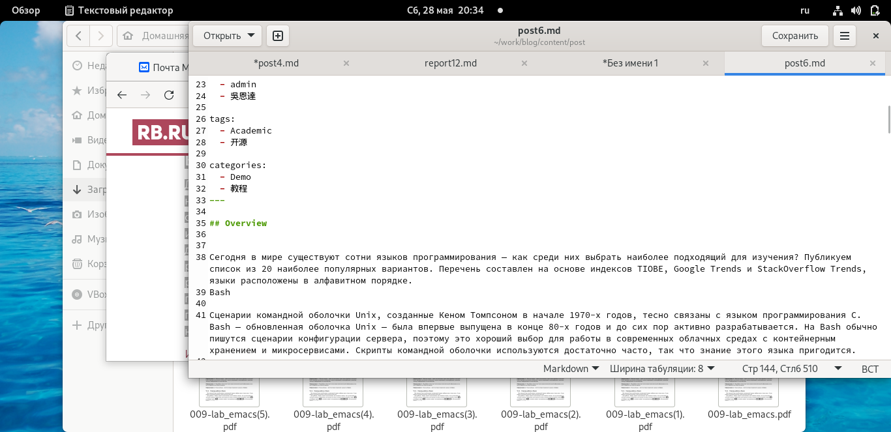
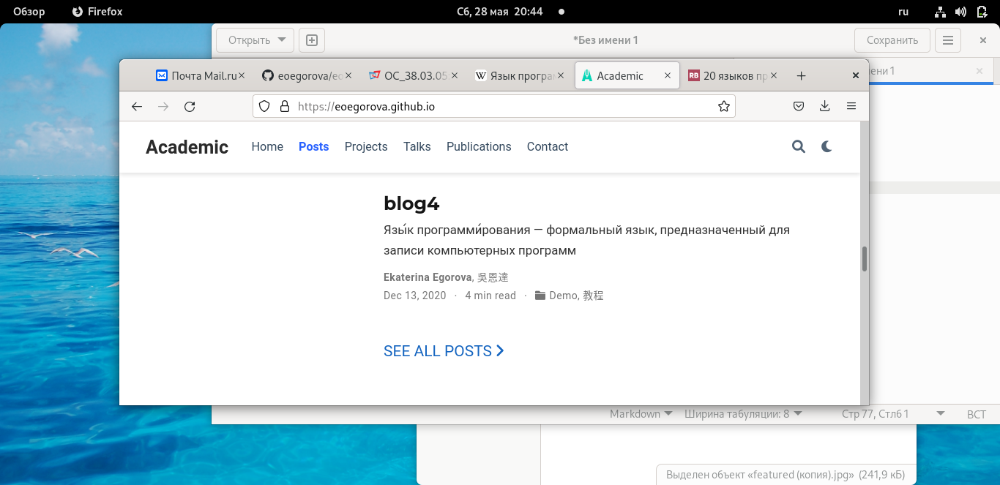

---
## Front matter
lang: ru-RU
title: Structural approach to the deep learning method
author: | Egorova Ekaterina Olegovna
	
institute: |
	\inst{1}RUDN University, Moscow, Russian Federation
	

## Formatting
toc: false
slide_level: 21
theme: metropolis
header-includes: 
 - \metroset{progressbar=frametitle,sectionpage=progressbar,numbering=fraction}
 - '\makeatletter'
 - '\beamer@ignorenonframefalse'
 - '\makeatother'
aspectratio: 43
section-titles: true
---

# Цель работы
Добавить с сайту все остальные элементы.

  

# Задание

    Сделать записи для персональных проектов.
    Сделать пост по прошедшей неделе.
    Добавить пост на тему по выбору.
        Языки научного программирования.

# Выполнение работы

## Сделала записи для персональных проектов. 

 рис.[-@fig:001] 
 
 
{ #fig:001 width=70% } 

## Сделала пост по прошедшей неделе. 

рис.[-@fig:002] 

{ #fig:002 width=70% }

##Добавить пост на тему по выбору.

рис.[-@fig:002] 

{ #fig:003 width=70% }
 
## Сайт 

рис.[-@fig:004] 

{ #fig:003 width=70%}
 
# Вывод

Научилась добавлять к сайту посты.

 

